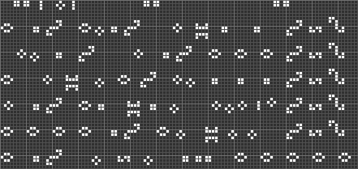

## Problem

The binary is a Game of Life simulator that accepts an arbitrary playfield
pattern, runs 15 iterations, and then segfaults. Disassembling it reveals that
after the 15th iteration of the simulation, it jumps into the playfield buffer
and runs it as x86 code.

## Simulation

The Game of Life playfield is 110x110 cells, with no wrapping. It is stored as a
bit-packed buffer, row-major, MSB first. Note that the width is not divisible by
8, so the byte boundaries differ on each row (there is no row padding).

## Problem

Throwing some shellcode into the buffer is easy, but the shellcode has to
survive 15 iterations of the simulation. This is not an easy problem. Instead of
trying to come up with some voodoo code to build a 15th predecessor to the
shellcode (which may not be practical), I decided to instead hand-craft the
shellcode out of "still life" patterns. Still life patterns are those which
do not change at all during the Game of Life simulation.

Useful still lives include:

      []        [][]      [][]    []    []            [][]    [][]  []
    []  []    []    []    [][]    [][][][]              []    []  [][]
      []        [][]            table on table    [][][]       snake
     tub      beehive    block    [][][][]      []integral
                                  []    []      [][]

... and their respective mirrored and rotated versions.

This restricts the bit patterns that are possible, but there are quite a few
useful ones.

In addition, I could also use trivial oscillators, such as the blinker:

                       []
    [][][]    ->       []
                       []

This is a simple period-2 oscillator. As the simulation runs 15 times, which
is an odd number, this needs to be in the opposite state to the desired one when
the pattern is fed in.

## Jumping around

All of the aforementioned patterns span more than one line, and lines interact
with each other. 110 bits is not enough for shellcode, so the code has to span
multiple lines of the playfield. To solve this, I decided to place jumps at
the end of each row.

Each row allows for 13 whole bytes to be included. The jump takes up the last
two bytes and jumps ahead 8 rows, so every 8 rows I have 11 bytes of space
available. By making the spacing a multiple of 8, I keep the rows byte aligned,
so I can set up an 8x8 grid and have it line up with the byte boundaries.

`jmp` (`e9` or `eb`) is hard to encode, with lots of 1 bits set. However, `jno`
is a lot easier (`71`), and most instructions clear the overflow bit, so it
behaves like an unconditional jump most of the time. `71 61` will jump ahead
from the end of a row to the beginning of the 8th row down.

This gives me a nice framework with lots of space for shellcode to fill in,
broken up by jumps, as long as I don't accidentally set the overflow bit.

## Padding

`nop` is easy to encode (`90` is just a beehive along the middle row), but
having that 1 bit on the left interacts badly with the previous instruction
quite often. I found a more useful 2-byte "nop": `add al,0x0` is `04 00`, which
is easy to encode with a tub (top or bottom row) and won't collide with adjacent
patterns. I used this at times before the final jump of a row, or between two
annoyingly colliding instructions. This also conveniently clears the overflow
bit.

## The Row 0 Problem

The still life patterns require more than one row, but the code begins executing
on the first row (row 0) where we can only support patterns from below. `jno`
needs 3 consecutive 1 bits, which need at least one support row above (as in the
blinker), so that's out. Instead, I decided to pad out the first row with some
kind of garbage instruction that would let me reach the second row and throw
a jump in there. A good choice for this ended up being `or eax, <foo>`, which
is `0d xx xx xx xx`. This can be encoded with a bi-block, and allows for 4 bytes
of padding. Three of these in sequence reach the second row, where a `jno` can
be encoded, intruding into the dummy operand bytes of the previous instructions.
The way the offset worked out, the first jump actually jumps to one byte before
the first normal row of code (row 8), but I set up the jump at the end of that
row (which is spatially below that byte) in a way that turned it into a harmless
`inc eax`, so that's no problem.

## Nice instructions

`eax` is a lot easier to work with than the other registers, so I do most of
my work on `eax` and then use `xchg` (which is a single byte) to move it into
other registers. For the immediate values that spell out `/bin/sh`, I split each
32-bit chunk into two chunks with alternate nybbles, which are added together.
This makes it much easier to encode, since every valid nybble value is easily
encodable using the above still life patterns, as long as it is surrounded by
whitespace.

`mov eax, imm` is annoying (`b8 xx xx xx xx`), but `add eax, imm` is a lot nicer
(`05 xx xx xx xx`), so I use the latter and just zero out `eax` first with
`xor eax, eax`.

Where adjacent instructions interact in a way that I can't trivially encode with
the still life patterns, I inserted the `04 00` "nop".

A more exhaustive search would easily reduce the size of the shellcode, but at
this point it was a lot easier to write verbose shellcode reusing a few "nice"
instructions than to try to find more optimal encodings.

## Tools

I used Golly to hand-craft the Life pattern, and wrote a simple plug-in
[script](mc2asm.py) to interpret it as x86 asm, remove garbage, and disassemble
the result. This allowed me to quickly see the effects of various patterns and
make sure I was not making any mistakes. The script also copies the ready-made
input for the challenge binary to the clipboard.

## Final solution

The final life pattern is completely static, except for two blinkers that form
part of the jump in the second row, and one blinker in the payload (that could
be removed by rearranging instructions a bit, but I got lazy).

The final shellcode disassembles to the following code, broken up into lines
and with junk bytes removed:

      0:   0d 80 20 00 00          or     eax,0x2080
      5:   0d 80 00 00 00          or     eax,0x80
      a:   0d 80 00 00 36          or     eax,0x36000080
      f:   71 5c                   jno    0x6d
     6d:   40                      inc    eax
    
     6e:   90                      nop
     6f:   31 c0                   xor    eax,eax
     71:   92                      xchg   edx,eax
     72:   31 c0                   xor    eax,eax
     74:   05 0f 03 08 00          add    eax,0x8030f
     79:   71 61                   jno    0xdc
    
     dc:   05 20 70 60 00          add    eax,0x607020
     e1:   50                      push   eax
     e2:   31 c0                   xor    eax,eax
     e4:   90                      nop
     e5:   90                      nop
     e6:   90                      nop
     e7:   71 61                   jno    0x14a
    
    14a:   90                      nop
    14b:   05 0f 02 09 0e          add    eax,0xe09020f
    150:   05 20 60 60 60          add    eax,0x60606020
    155:   71 61                   jno    0x1b8
    
    1b8:   50                      push   eax
    1b9:   31 c0                   xor    eax,eax
    1bb:   93                      xchg   ebx,eax
    1bc:   01 e3                   add    ebx,esp
    1be:   04 00                   add    al,0x0
    1c0:   52                      push   edx
    1c1:   53                      push   ebx
    1c2:   90                      nop
    1c3:   71 61                   jno    0x226
    
    226:   90                      nop
    227:   90                      nop
    228:   90                      nop
    229:   90                      nop
    22a:   31 c0                   xor    eax,eax
    22c:   91                      xchg   ecx,eax
    22d:   01 e1                   add    ecx,esp
    22f:   04 00                   add    al,0x0
    231:   71 61                   jno    0x294
    
    294:   90                      nop
    295:   31 c0                   xor    eax,eax
    297:   04 0b                   add    al,0xb
    299:   04 00                   add    al,0x0
    29b:   cd 80                   int    0x80

This is just a typical `execve("/bin/sh", ["/bin/sh", NULL], NULL)` shellcode,
built out of nice-to-encode instructions. Thankfully, `int 0x80` is very easy to
encode (just three blocks).

## Snags

The original solution didn't set `argv[0]`. This worked locally, but failed on
the vulnbox (with no error message). I tried `/bin/ls` instead, and that
complained about `argv[0]`, so I guessed that maybe it was some other shell that
didn't like the unset argv. Setting `argv[0]` made the solution work, and
revealed that the challenge was running inside a minimal Docker container with
only a Busybox environment. Busybox is a multicall binary, so of course it
needs a sane `argv[0]`.

